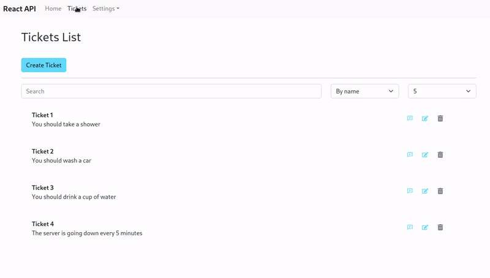

<p align="center">
  <a href="https://www.linkedin.com/in/zakharb/reactapi">
  
</p>

<p align="center">

<a href="https://git.io/typing-svg">
  


</p>

<p align="center">
  
  
</p>


<p align="center">
  
</p>


## :blue_square: Getting Started

[ReactAPI](https://github.com/zakharb/reactapi) is an example of user interface based on  
- JavaScript library [React](https://en.wikipedia.org/wiki/React_(JavaScript_library))on the Frontend   
- [FastAPI](https://en.wikipedia.org/wiki/FastAPI) and [Postgres](https://en.wikipedia.org/wiki/PostgreSQL) on the Backend   

For CRUD operations is used `Tickets-Comments` model  
> The user can create `Tickects` and add `Comments` to them  

The UI is in reactive mode and notifies changes immediately  
Backend works in async mode with high performance and lightweight API  

### Requirements


### Installing

Clone the project

```
git clone git@github.com:zakharb/reactapi.git
cd reactapi
```

Start docker-compose

```
docker-compose up -d
```

<p align="center">
  
</p>

## :blue_square: Usage  

### Tickets  
Get, put, update, delete `Tickets` via API [Tickets](http://localhost:8080/api/v1/tickets/docs)    
<p align="center">
  
</p>

### Comments    
Get, put, update, delete `Comments` via API [Comments](http://localhost:8080/api/v1/comments/docs)  
<p align="center">
  
</p>

## :blue_square: Deployment

Edit `Dockerfile` for each Microservice and deploy container

## :blue_square: Versioning

Using [SemVer](http://semver.org/) for versioning. For the versions available, see the [tags on this repository](https://github.com/zakharb/reactapi/tags). 

## :blue_square: Authors

* **Zakhar Bengart** - *Initial work* - [Ze](https://github.com/zakharb)

See also the list of [contributors](https://github.com/zakharb/reactapi/contributors) who participated in this project.

## :blue_square: License

This program is free software: you can redistribute it and/or modify it under the terms of the GNU General Public License as published by the Free Software Foundation - see the [LICENSE](LICENSE) file for details
